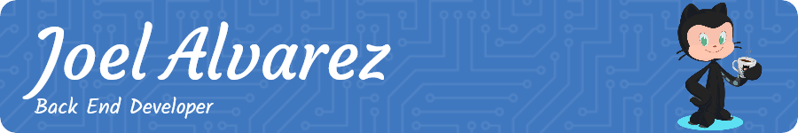

<h2>Hi 👋, I'm Joel Alvarez</h2>
<h4>A passionate frontend And Backend developer from México</h4>

 

   
   
   

* 🍁 I am a Back end Developer based in Morelia, MX
* 👉 Check out my portfolio site [here](https://joel-alvarez.netlify.app/) 👈
* 👩🏻‍💻 I’m currently working on [Hundsport](http://hundsport.mx/) & [Animarama](https://animarama.com.mx/)
* 🌱 I am currently working on personal projects using Laravel, Firebase, GraphQL and PostgresQL
* 🪄 I really enjoy back end development and creating memorable user experiences
* 🧰 Tools & Technologies I'd love to explore include TypeScript, React, Redux and Python.
* 🎮🦸‍♂️🕺 Fun facts about me: I love playing video games (PUBG mobile), Marvel or Action movies, practicing Soccer or watching NFL or F1. I love to dance Salsa.
* 📫 How to reach me: [email me](mailto:softcodec@gmail.com) or connect with me on [LinkedIn](https://www.linkedin.com/in/joel-alvarez/)

| I am | I love | Some of my work |
| :--- | :----- | :-------------- |
|• a **curious**, **creative** and detail-oriented person. • a reliable **team leader**. • a persistent coder. • a quiet and humble human. • an **entrepreneur**. • more than anything, **a doer**.|• to **build products**: from design to launch. • to **solve** high impact **problems**. • to keep learning. • **building** companies. • outdoors. • craft beer, coffee and pizza.|• [TecNM Valle de Morelia](https://vmorelia.tecnm.mx/) • [Colegios Motolinia Morelia](https://www.colegiosmotolinia.edu.mx/) • [Instituto Panamericano](http://instituto-panamericano.edu.mx/) • [UNICLA](https://unicla.edu.mx/) • [UNITECH TI](https://unitechti.mx/) • [INNARDI](https://innardi.edu.mx/)

<h3 align="center"> Languages & Tools I enjoy using:</h3>

   
     
                      

  
   
<h3 align="center">OS & Code Editors</h3>

   
               

<h3 align="center">Github Stats</h3>

    
    
    
    
    

